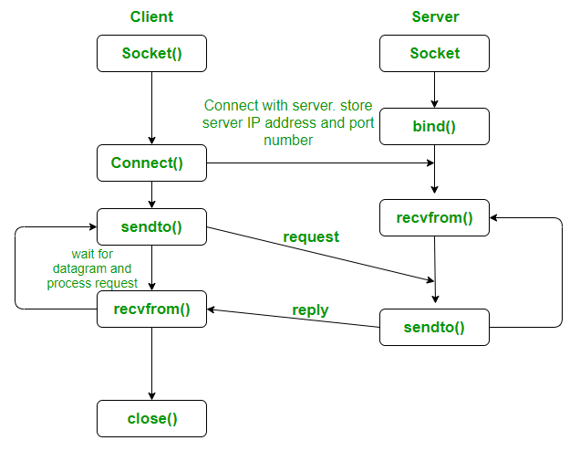

## Multicast

Multicast is a distributed systems concept for group communication over a network (one-to-many or many-to-many). The choice of the network “transport layer” which the Multicast uses determines its type for example, IP Multicast is sending a multicast over the IP layer and UDP Multicast is sending it over the User Datagram Protocol (UDP) layer that doesn’t provide any deliverability guarantees, so it’s unreliable massages may be lost or delivered out of order. But this makes UDP Multicast also fast, lightweight, and the protocol of choice for many streaming scenarios such as Netflix sending UDP Multicast to all watchers of a specific show.

    
    
<b>UDP Diagram</b>

